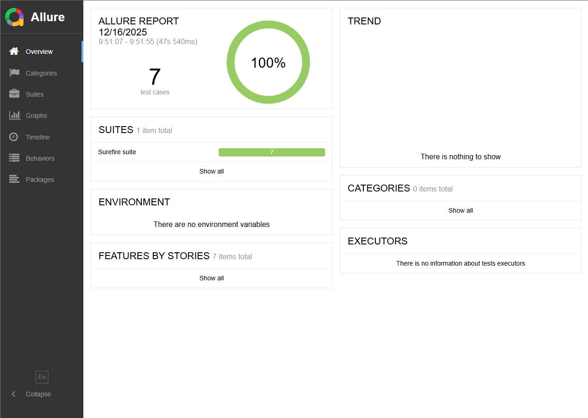

# JavaTestMatrix

[](https://github.com/Erick-oGarcia/JavaTestMatrix/actions/workflows/ci-pipeline.yml)
[](https://Erick-oGarcia.github.io/JavaTestMatrix/)
[](https://opensource.org/licenses/MIT)

A robust Test Automation Framework for UI and API testing, built with Selenium, Java, and TestNG. This project demonstrates a scalable and maintainable architecture for enterprise-level test automation.

## ✨ Key Features

-   **UI & API Testing**: Comprehensive test suites for both web interfaces and RESTful APIs.
-   **Page Object Model (POM)**: For clean, maintainable, and reusable UI test code.
-   **Centralized API Client**: A reusable RestAssured setup for streamlined API testing.
-   **Multi-Browser Support**: Easily configurable for Chrome, Firefox, and other browsers.
-   **Headless Execution**: Run UI tests in a headless environment, perfect for CI/CD pipelines.
-   **Allure Reports**: Generate beautiful, interactive, and detailed test reports, published to GitHub Pages.
-   **CI/CD with GitHub Actions**: Automated build, test, and reporting pipeline.
-   **Secure API Key Management**: Loads API keys from environment variables, system properties, or a local `.env` file.

## 🛠️ Tech Stack

-   **Java 17**
-   **Selenium WebDriver**: For browser automation.
-   **TestNG**: As the testing framework.
-   **RestAssured**: For REST API testing.
-   **Apache Maven**: For dependency management and building the project.
-   **Allure Framework**: For test reporting.
-   **GitHub Actions**: For CI/CD.

## 📂 Project Structure

The framework follows a standard Maven project structure, organized for scalability and clarity:

```
JavaTestMatrix/
│
├── pom.xml                # Main Maven file. Defines dependencies, plugins, and how the project is built.
│
├── testng.xml             # TestNG test suite. Allows grouping and running specific tests (e.g., UI, API).
│
├── README.md              # Project documentation.
│
├── .github/workflows/
│   └── ci-pipeline.yml    # Defines the Continuous Integration (CI) pipeline with GitHub Actions.
│   └── allure-report.yml  # Defines the workflow for generating and deploying Allure Reports to GitHub Pages.
│
├── allure-results/        # Directory where raw Allure results are generated after test execution.
│
├── assets/                # Contains resources for documentation, like the Allure report image.
│
└── src/
    ├── main/              # (Empty) Would contain the application's source code, if any.
    │
    └── test/
        ├── java/
        │   └── .../
        │       ├── api/
        │       │   ├── models/         # POJOs (Plain Old Java Objects) to represent API request/response bodies.
        │       │   ├── APIClient.java  # Base class for API tests. Configures RestAssured (baseURI, headers).
        │       │   └── *APITest.java   # Specific test classes for API endpoints.
        │       │
        │       ├── base/
        │       │   └── BaseTest.java   # Base class for UI tests. Manages the WebDriver lifecycle (setup/teardown).
        │       │
        │       ├── listeners/
        │       │   └── TestListener.java # TestNG listener for custom actions (e.g., taking screenshots on failure).
        │       │
        │       ├── pages/
        │       │   └── *Page.java      # Page Object Model classes. Map UI elements and actions for each page.
        │       │
        │       ├── tests/
        │       │   └── *Test.java      # UI test case classes that use Page Objects.
        │       │
        │       └── utils/
        │           ├── ConfigLoader.java # Loads configurations from files (.properties, .env) and environment variables.
        │           └── ScreenshotUtils.java # Utility for capturing screen screenshots.
        │
        └── resources/
            ├── config.properties # Properties file to store URLs, users, etc.
            └── log4j2.xml        # Configuration for the logging system (Log4j2).

```

## 🚀 Getting Started

### Prerequisites

-   **JDK 17** or higher.
-   **Apache Maven**.
-   **Google Chrome** or **Mozilla Firefox**.
-   **Allure Commandline**: Required to generate reports locally. For Windows, you can install it using [Scoop](https://scoop.sh/):
    ```bash
    scoop install allure
    ```
    For other operating systems, see the official [installation guide](https://allurereport.org/docs/gettingstarted-installation/).

### Local Setup & Execution

1.  **Clone the repository:**
    ```bash
    git clone https://github.com/Erick-oGarcia/JavaTestMatrix.git
    cd JavaTestMatrix
    ```

2.  **API Key Configuration (Optional):**
    For API tests, create a `.env` file in the project root and add your API key:
    ```
    API_KEY="your_api_key_here"
    ```

3.  **Run Tests:**
    -   **Run all tests:**
        ```bash
        mvn clean test
        ```
    -   **Run a specific TestNG suite:**
        ```bash
        mvn clean test -Dsurefire.suiteXmlFiles=testng.xml
        ```

## 📊 Allure Reports

After running the tests, generate and view the Allure report from the project's root directory:

```bash
allure serve allure-results
```
Alternatively, you can access the automatically generated Allure Report via GitHub Pages, which is deployed to the `allure-reports` branch. The link is typically: `https://Erick-oGarcia.github.io/JavaTestMatrix/`



## 🔄 CI/CD Pipeline

This project uses **GitHub Actions** for continuous integration and continuous deployment of Allure Reports.

-   **`ci-pipeline.yml`**: The main workflow runs on every `push` or `pull_request` to the `main` branch, executing tests and uploading Allure results as artifacts.
-   **`allure-report.yml`**: This workflow is triggered upon completion of `ci-pipeline.yml`. It downloads the Allure results, generates the report, and deploys it to GitHub Pages on the `allure-reports` branch.
-   **Secrets**: For the pipeline to run API tests successfully, you must add your API key as a secret in your GitHub repository:
    -   Navigate to `Settings` > `Secrets and variables` > `Actions`.
    -   Create a new secret named `API_KEY` with your API key as the value.

## 🔮 Future Improvements

-   [ ] Integrate with a cloud testing platform (e.g., BrowserStack, Sauce Labs).
-   [ ] Implement visual regression testing.
-   [ ] Add support for containerized execution with Docker.
-   [ ] Increase test coverage for API and UI modules.

## 🤝 Contributing

Contributions are welcome! If you have suggestions for improving this framework, please feel free to create an issue or submit a pull request.

1.  Fork the Project.
2.  Create your Feature Branch (`git checkout -b feature/AmazingFeature`).
3.  Commit your Changes (`git commit -m 'Add some AmazingFeature'`).
4.  Push to the Branch (`git push origin feature/AmazingFeature`).
5.  Open a Pull Request.

## 📄 License

This project is licensed under the MIT License. See the [LICENSE](LICENSE) file for details.

## ✍️ Author

-   **Erick Oliveira Garcia**
    -   GitHub: [@Erick-oGarcia](https://github.com/Erick-oGarcia)
    -   LinkedIn: [erick-garcia](https://www.linkedin.com/in/erick-garcia-399b2b161/)
